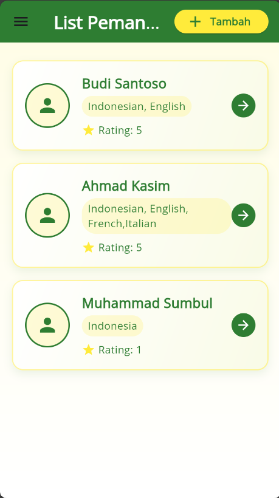

# SS HASIL RESPONSI

## 1. Halaman Login
Pengguna dapat masuk ke dalam aplikasi dengan memasukkan email dan password.

---

## 2. Halaman Registrasi
Pengguna baru dapat membuat akun dengan mengisi form registrasi.

---

## 3. Daftar Pemandu
Setelah login berhasil, pengguna akan diarahkan ke halaman daftar pemandu yang tersedia.

---

## 4. Detail Pemandu
Pengguna dapat melihat informasi detail dari setiap pemandu, seperti nama, bahasa yang dikuasai, dan rating.

---

## 5. Tambah Pemandu
Pengguna dapat menambahkan pemandu baru dengan mengisi form yang tersedia.

---

## 6. Ubah Pemandu
Pengguna juga bisa mengubah informasi pemandu yang sudah ada.

---

## 7. Hapus Pemandu
Jika diperlukan, pengguna dapat menghapus pemandu dari daftar.

---

## 8. Sukses Login
Tampilan notifikasi ketika login berhasil dilakukan.

---

## 9. Gagal Login
Tampilan notifikasi ketika login gagal dilakukan karena email atau password salah.

---

## 10. Logout
Pengguna dapat logout dari aplikasi melalui menu ini.

---
